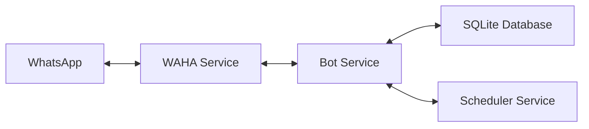

# WhatsApp Schedule Bot

A powerful WhatsApp bot for managing class schedules and task reminders with automatic notifications. Built with Node.js, Express, and WAHA (WhatsApp HTTP API).

## 📋 Overview

This bot helps students and teachers manage their class schedules through WhatsApp. It supports:

- **Task Management**: Add, view, and delete tasks with deadlines
- **Automatic Reminders**: Get notified 15 minutes before scheduled tasks
- **Multi-Group Support**: Each WhatsApp group has independent task lists
- **Timezone Support**: Configurable timezone per group (default: WIB/Asia/Jakarta)
- **Weekly Schedules**: Support for recurring weekly tasks

## 🏗️ Architecture

The project consists of two main services running in Docker containers:



### Components

1. **WAHA Service** (`waha` container)
   - WhatsApp HTTP API service
   - Handles WhatsApp connection and message routing
   - Runs on port 3000

2. **Bot Service** (`bot` container)
   - Express.js REST API
   - Command processing and business logic
   - Automated reminder scheduler
   - Runs on port 5555

3. **SQLite Database**
   - Stores schedules, reminders, and group settings
   - Persistent storage via Docker volumes

## 🚀 Getting Started

### Prerequisites

- Docker and Docker Compose
- WhatsApp account for the bot

### Installation

1. **Clone the repository**
   ```bash
   git clone <repository-url>
   cd wabot
   ```

2. **Configure environment variables**
   
   Edit `bot/Backend/.env`:
   ```env
   # Environment Configuration
   NODE_ENV=development
   PORT=5555
   
   # WAHA Configuration
   WAHA_URL=http://waha:3000
   WAHA_TOKEN=your-secure-token-here
   WAHA_SESSION_NAME=default
   
   # Bot Configuration
   BOT_PREFIX=!
   BOT_NAME=Schedule Reminder Bot
   
   # WAHA Dashboard Credentials
   WAHA_DASHBOARD_USERNAME=admin
   WAHA_DASHBOARD_PASSWORD=your-password-here
   ```

3. **Start the services**
   ```bash
   docker-compose up -d
   ```

4. **Connect WhatsApp**
   - Open WAHA dashboard: http://localhost:3000
   - Login with credentials from `.env`
   - Scan QR code with WhatsApp
   - Wait for connection to establish

5. **Verify bot is running**
   ```bash
   curl http://localhost:5555/health
   ```

## 📱 Usage

### Available Commands

All commands start with the prefix `!` (configurable in `.env`):

#### Basic Commands

- **`!start`** - Welcome message and bot introduction
- **`!commands`** - List all available commands

#### Task Management

- **`!tugas-tambah <name> | <subject> | <deadline>`**
  
  Add a new task with deadline
  
  **Format**: `DD/MM/YYYY HH:mm` (24-hour format, WIB timezone)
  
  **Example**:
  ```
  !tugas-tambah Laporan Akhir | Pemrograman Web | 25/11/2025 14:00
  ```

- **`!tugas`**
  
  View all active tasks grouped by date
  
  **Example output**:
  ```
  📅 *Daftar Tugas Aktif*
  
  📆 *Senin, 25/11/2025*
  
  📚 *Laporan Akhir*
  👨‍🏫 Subject: Pemrograman Web
  ⏰ Time: 14:00
  🆔 ID: 1
  ```

- **`!tugas-hapus <task-id>`**
  
  Delete a task by its ID
  
  **Example**:
  ```
  !tugas-hapus 1
  ```

#### Settings

- **`!timezone-edit <timezone>`** or **`!tz <timezone>`**
  
  Change the timezone for the current group
  
  **Example**:
  ```
  !timezone-edit Asia/Tokyo
  !tz America/New_York
  ```

### How It Works

1. **Adding Tasks**
   - User sends command to WhatsApp group
   - Bot receives webhook from WAHA
   - Command is parsed and validated
   - Task is stored in SQLite database
   - Reminder is scheduled 15 minutes before deadline

2. **Automatic Reminders**
   - Scheduler runs every minute
   - Checks for upcoming reminders
   - Sends WhatsApp message to the group
   - Marks reminder as sent

3. **Multi-Group Support**
   - Each group has a unique `chatId`
   - Tasks are isolated per group
   - Independent timezone settings per group

## 🛠️ Development

### Project Structure

```
wabot/
├── bot/
│   ├── Backend/
│   │   ├── src/
│   │   │   ├── app.js              # Main application entry
│   │   │   ├── controllers/        # Command handlers
│   │   │   ├── middleware/         # Command processor
│   │   │   ├── models/             # Database models
│   │   │   ├── routes/             # API routes
│   │   │   ├── services/           # Business logic
│   │   │   └── utils/              # Database & utilities
│   │   ├── scripts/                # Test scripts
│   │   ├── data/                   # SQLite database
│   │   ├── logs/                   # Application logs
│   │   ├── package.json
│   │   └── .env
│   └── Dockerfile
├── waha/                           # WAHA data volume
├── docker-compose.yml
└── README.md
```

### Key Files

- **`src/app.js`** - Express server initialization
- **`src/middleware/commandProcessor.js`** - Webhook handler and command router
- **`src/controllers/commandController.js`** - Command implementation
- **`src/models/Schedule.js`** - Schedule database model
- **`src/services/schedulerService.js`** - Cron-based reminder scheduler
- **`src/services/wahaService.js`** - WAHA API client

### Running in Development Mode

```bash
cd bot/Backend
npm install
npm run dev
```

### Database Schema

**schedules** table:
- `id` - Primary key
- `chat_id` - WhatsApp group ID
- `user_phone` - Creator's phone number
- `schedule_name` - Task name
- `teacher_code` - Subject/teacher code
- `room` - Room/location
- `schedule_datetime` - Task deadline (UTC)
- `day_of_week` - Day name
- `is_weekly` - Recurring flag
- `is_active` - Soft delete flag

**reminders** table:
- `id` - Primary key
- `schedule_id` - Foreign key to schedules
- `reminder_datetime` - When to send reminder (UTC)
- `is_sent` - Sent status flag

**group_settings** table:
- `id` - Primary key
- `chat_id` - WhatsApp group ID
- `timezone` - Group timezone (default: Asia/Jakarta)

## 🔧 Configuration

### Environment Variables

| Variable | Description | Default |
|----------|-------------|---------|
| `NODE_ENV` | Environment mode | `development` |
| `PORT` | Bot service port | `5555` |
| `WAHA_URL` | WAHA service URL | `http://waha:3000` |
| `WAHA_TOKEN` | WAHA API token | - |
| `WAHA_SESSION_NAME` | WhatsApp session name | `default` |
| `BOT_PREFIX` | Command prefix | `!` |
| `BOT_NAME` | Bot display name | `Schedule Reminder Bot` |

### Docker Compose Services

```yaml
services:
  waha:
    - Runs WAHA WhatsApp API
    - Port: 3000
    - Volume: ./waha (persistent data)
  
  bot:
    - Runs Node.js bot application
    - Port: 5555
    - Volumes: logs, data (persistent)
    - Depends on: waha (with health check)
```

## 📊 API Endpoints

### Health Check
- **GET** `/health` - Service health status

### Webhooks
- **POST** `/api/webhook` - WAHA webhook receiver

### Schedules
- **GET** `/api/schedules` - List all schedules
- **POST** `/api/schedules` - Create new schedule
- **DELETE** `/api/schedules/:id` - Delete schedule

### Commands
- **POST** `/api/commands` - Execute bot command programmatically

## 🐛 Troubleshooting

### Bot not responding to commands

1. Check if services are running:
   ```bash
   docker-compose ps
   ```

2. Check bot logs:
   ```bash
   docker-compose logs -f bot
   ```

3. Verify WAHA connection:
   - Visit http://localhost:3000
   - Check session status

### Reminders not being sent

1. Check scheduler service logs
2. Verify timezone settings for the group
3. Ensure database contains reminders:
   ```bash
   docker exec -it reminder-bot sqlite3 /app/data/schedules.db "SELECT * FROM reminders WHERE is_sent = 0;"
   ```

### Database issues

Reset database:
```bash
docker-compose down
rm -rf bot/Backend/data/schedules.db
docker-compose up -d
```

## 📝 License

MIT

## 🤝 Contributing

1. Fork the repository
2. Create a feature branch
3. Commit your changes
4. Push to the branch
5. Create a Pull Request

## 📧 Support

For issues and questions, please open an issue on the repository.

---

**Built with ❤️ using Node.js, Express, and WAHA**
